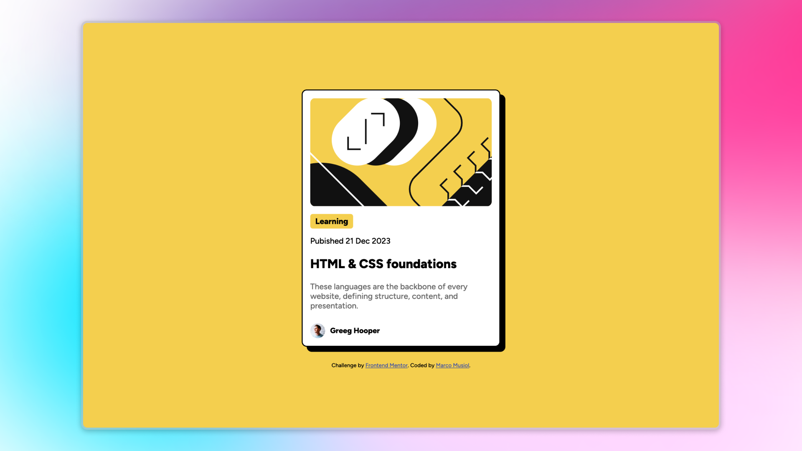

# Blog Preview Card Solution 🚀

This is my solution for a [Frontend Mentor Challenge](https://www.frontendmentor.io/challenges/blog-preview-card-ckPaj01IcS) – a Blog Preview Card. This project is built using **HTML5**, **CSS**, and **Flexbox**.

## 📸 Preview

## 🌐 Live Demo

Check out the live version here: [Live Site](#)

## 📂 Project Overview

This project is a simple and elegant blog preview card designed to practice front-end skills. The challenge was to replicate a given design and make it responsive.

### Features ✨

- Clean and semantic HTML5 structure
- Modern CSS styling with Flexbox

## 🛠️ Built With

- **HTML5**
- **CSS**
- **Flexbox**

## 🖼️ Screenshot

 <!-- Replace with your screenshot path -->

## 🧑‍💻 Author

- Frontend Mentor Profile: [Marco Musiol](https://www.frontendmentor.io/profile/musiolmarco)
- GitHub: [Marco Musiol](https://github.com/musiolmarco)

## 🙌 Acknowledgments

A big thanks to [Frontend Mentor](https://www.frontendmentor.io) for providing these awesome challenges to improve front-end development skills.

---
